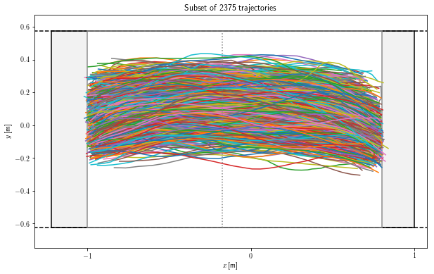
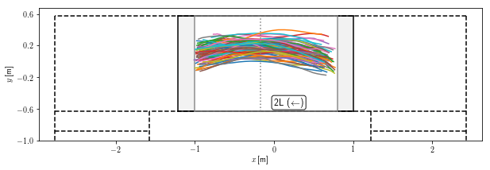
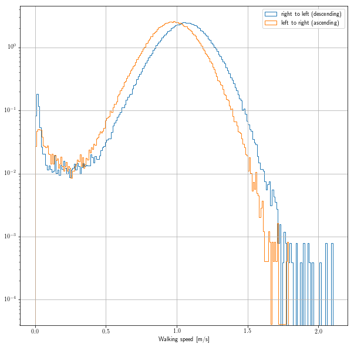

# Visualization of pedestrian trajectories from the crowdflow experiment at Eindhoven University of Technology

This repository contains primers and examples to analyze the pedestrian tracking dataset collected at Eindhoven University of Technology (see our Physical Review E paper *Fluctuations around mean walking behaviors in diluted pedestrian flows*, A.Corbetta, C.Lee, R. Benzi, A.Muntean, F.Toschi,  https://doi.org/10.1103/PhysRevE.95.032316 ). 

The dataset  has `DOI`: `10.4121/uuid:25289586-4fda-4931-8904-d63efe4aa0b8`  and will soon be downloadable from the `4TU.ResearchData` server.





The dataset contains 20.000 pedestrian trajectories recorded on a nearly 24/7 schedule in a landing in the Metaforum building at Eindhoven University of Technology. The data acquisition spanned over a year and, overall, nearly 250.000 trajectories have been collected. The purpose of the dataset is to enable ensemble analyses of diluted pedestrian motion. Depth imaging data has been first obtained via an overhead Microsoft Kinect sensor. Hence, ad hoc localization algorithms and PTV-like tracking have been employed to estimate the trajectory of individual heads (cf. publication). [Further information is available on our webpage.](http://crowdflow.phys.tue.nl/wordpress/projects/2013-tue-metaforum-landing/)


This [jupyter notebook](Plot-trajectories.ipynb) shows how to use [python pandas](http://pandas.pydata.org/) and the functions in the file [`MF_domain_related.py`](MF_domain_related.py) to visualize the trajectories. 

## If you use the dataset please cite
**this publication**
```
@article{PhysRevE.95.032316,
  title = {Fluctuations around mean walking behaviors in diluted pedestrian flows},
  author = {Corbetta, Alessandro and Lee, Chung-min and Benzi, Roberto and Muntean, Adrian and Toschi, Federico},
  journal = {Phys. Rev. E},
  volume = {95},
  issue = {3},
  pages = {032316},
  numpages = {9},
  year = {2017},
  month = {Mar},
  publisher = {American Physical Society},
  doi = {10.1103/PhysRevE.95.032316},
  url = {https://link.aps.org/doi/10.1103/PhysRevE.95.032316}
}
```
as well as the dataset (`10.4121/uuid:25289586-4fda-4931-8904-d63efe4aa0b8`).


## Examples:

Trajectories visualization 



Position depth map


Walking speed pdf conditioned to the walking direction


